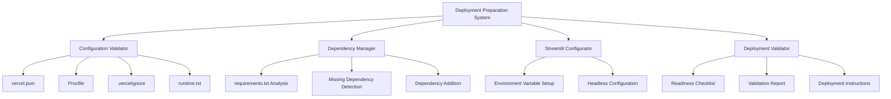

# Design Document

## Overview

This design outlines the system for preparing a Streamlit application for successful deployment on Vercel. The system will validate and generate necessary configuration files, ensure proper dependency management, configure Streamlit for headless operation, and provide deployment validation and guidance.

The current application is a Financefly Connector that integrates with Pluggy API for bank account connections. It already has basic Vercel configuration and proper headless setup, but requires validation and potential enhancements for robust deployment.

## Architecture

The deployment preparation system follows a validation-first approach with automatic remediation:



## Components and Interfaces

### 1. Configuration File Manager

**Purpose**: Generate and validate Vercel deployment configuration files

**Key Methods**:
- `validate_vercel_json()`: Ensures proper build and routing configuration
- `create_procfile()`: Generates Streamlit startup command
- `create_vercelignore()`: Excludes unnecessary files from deployment
- `create_runtime_txt()`: Specifies Python runtime version

**Configuration Templates**:

**vercel.json**:
```json
{
  "version": 2,
  "builds": [
    {
      "src": "app.py",
      "use": "@vercel/python"
    }
  ],
  "routes": [
    {
      "src": "/(.*)",
      "dest": "app.py"
    }
  ],
  "env": {
    "STREAMLIT_SERVER_HEADLESS": "true",
    "STREAMLIT_SERVER_PORT": "8080",
    "STREAMLIT_SERVER_ADDRESS": "0.0.0.0"
  }
}
```

**Procfile**:
```
web: streamlit run app.py --server.port=$PORT --server.address=0.0.0.0 --server.headless=true
```

**.vercelignore**:
```
__pycache__/
*.pyc
.env
.git/
.vscode/
test_*.py
validation_report_*.json
```

**runtime.txt**:
```
python-3.11
```

### 2. Dependency Validator

**Purpose**: Ensure all required packages are properly specified in requirements.txt

**Key Methods**:
- `parse_requirements()`: Parse existing requirements.txt
- `validate_required_packages()`: Check for mandatory dependencies
- `add_missing_dependencies()`: Append missing packages
- `validate_versions()`: Ensure compatible package versions

**Required Dependencies**:
- streamlit==1.38.0
- python-dotenv==1.0.1
- psycopg[binary]==3.2.10
- requests==2.32.3
- gunicorn (for WSGI compatibility)

### 3. Streamlit Configuration Manager

**Purpose**: Ensure proper headless configuration for serverless deployment

**Key Methods**:
- `validate_headless_config()`: Check environment variable setup
- `inject_config_if_missing()`: Add configuration to app.py if needed
- `validate_config_placement()`: Ensure config is set before imports

**Required Configuration** (already present in current app.py):
```python
os.environ["STREAMLIT_SERVER_HEADLESS"] = "true"
os.environ["STREAMLIT_SERVER_PORT"] = os.getenv("PORT", "8080")
os.environ["STREAMLIT_SERVER_ADDRESS"] = "0.0.0.0"
```

### 4. Deployment Validator

**Purpose**: Comprehensive validation of deployment readiness

**Key Methods**:
- `run_deployment_checks()`: Execute all validation steps
- `generate_checklist()`: Create deployment readiness checklist
- `create_validation_report()`: Generate detailed validation report
- `provide_deployment_instructions()`: Create step-by-step deployment guide

## Data Models

### ValidationResult
```python
@dataclass
class ValidationResult:
    component: str
    status: str  # "pass", "fail", "warning"
    message: str
    fix_applied: bool = False
```

### DeploymentConfig
```python
@dataclass
class DeploymentConfig:
    vercel_json_valid: bool
    procfile_exists: bool
    vercelignore_exists: bool
    runtime_txt_exists: bool
    dependencies_valid: bool
    streamlit_config_valid: bool
    overall_ready: bool
```

## Error Handling

### Configuration File Errors
- **Missing Files**: Automatically create with default templates
- **Invalid JSON**: Validate syntax and fix common issues
- **Incorrect Routing**: Update routes to properly handle Streamlit

### Dependency Errors
- **Missing Packages**: Add to requirements.txt with specified versions
- **Version Conflicts**: Report conflicts and suggest resolutions
- **Invalid Syntax**: Fix requirements.txt formatting issues

### Streamlit Configuration Errors
- **Missing Environment Variables**: Inject proper configuration
- **Incorrect Placement**: Move configuration before imports
- **Invalid Values**: Correct environment variable values

### Deployment Validation Errors
- **Port Configuration**: Ensure proper PORT environment variable usage
- **File Permissions**: Validate file accessibility
- **Import Errors**: Check for missing dependencies or syntax issues

## Testing Strategy

### Unit Tests
- Configuration file generation and validation
- Dependency parsing and validation
- Streamlit configuration detection
- Error handling for various failure scenarios

### Integration Tests
- End-to-end deployment preparation workflow
- Validation of generated configuration files
- Compatibility testing with Vercel platform requirements

### Validation Tests
- Deployment readiness verification
- Configuration file syntax validation
- Dependency resolution testing
- Streamlit headless operation verification

## Implementation Notes

### Current Application Analysis
The existing app.py already includes:
- ✅ Proper headless configuration (set before imports)
- ✅ Correct environment variable setup
- ✅ Basic Vercel configuration exists

### Required Enhancements
1. Add gunicorn to requirements.txt for WSGI compatibility
2. Create Procfile for explicit Streamlit startup command
3. Create .vercelignore to optimize deployment size
4. Create runtime.txt for Python version specification
5. Enhance vercel.json with environment variables
6. Implement comprehensive validation system

### Deployment Optimization
- Exclude test files and development artifacts
- Minimize deployment package size
- Ensure proper environment variable handling
- Validate all configuration files before deployment